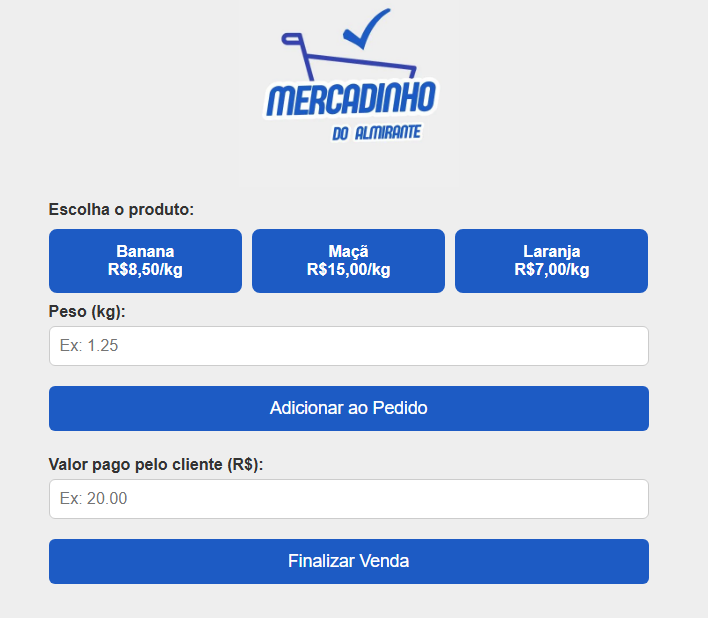
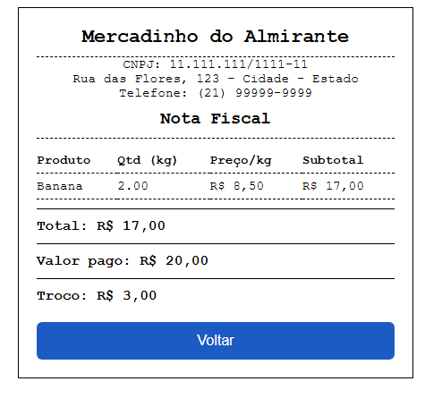

# PDV - Mercadinho do Almirante

Este projeto é uma simulação de ponto de venda (PDV), utilizada no projeto "Matemática na Feira", voltado para turmas do 7º ano do Ensino Fundamental da rede pública.

## Aplicação
Os alunos atuaram como operadores de caixa em uma simulação de feira, realizando:

- Pesagem dos produtos com balança digital.
- Cálculo do valor total das compras.
- Recebimento com dinheiro fictício.
- Registro da venda no sistema de caixa simulado.

Projeto:

## Como usar

1. Abra o arquivo `index.html` em seu navegador.
2. Escolha o produto, informe o peso, adicione ao pedido e finalize a venda informando o valor pago.

## Estrutura do projeto
- `index.html`: Página principal do PDV
- `style.css`: Estilos da interface
- `script.js`: Lógica do PDV
- `assets/`: Pasta para imagens 

> Obs: A imagem `logo.jpg` deve ser adicionada manualmente na pasta `assets`.

## Licença
Uso educacional e demonstração.

## Disponível em:
https://matematica360.com.br/pdv/